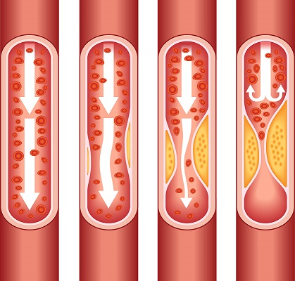

```{r basicfcn}
# can add quietly=T option to the require() function
loadPkg = function(x) { if (!require(x,character.only=T, quietly =T)) { install.packages(x,dep=T,repos="http://cran.us.r-project.org"); if(!require(x,character.only=T)) stop("Package not found") } }
```

## Chapter 1: Introduction of Cardiovascular Disease:

Based on The World Health Organization (WHO), Cardiovascular diseases (CVDs) are disorders related to the heart and blood vessels. The diseases mainly caused by fatty deposits plaque builds up on the inner walls of the blood vessels which prevent prevents blood from flowing to the heart or brain. 




According to 2016 report, cardiovascular disease remains the leading cause of death in the United States (Benjamin et al., 2019). Around 80% of CVD deaths are a heart attack and stroke. The cause of cardiovascular diseases is usually the presence of a combination of risk factors, such as unhealthy diet, obesity, physical inactivity, tobacco use and harmful use of alcohol.

Body mass index (BMI) is a value calculated from the weight and height of a person, the equation is kg(kilogram)/m(meter)^2. It is a measurement to assess a person’s total amount of body fat. As measuring BMI only needs a person’s weight and height, it has been widely used in public health and clinical settings.

Since there are many reports indicated that the cause of cardiovascular diseases is associated with our BMI and lifestyle. Therefore, we want to evaluate whether these factors truly correlate with the developing of the disease. 
 
 
## Chapter 2: Description of Data and Exploratory Data Analysis

### 2.1 Source Data
The source data for our EDA is a CSV containing 70,000 records of patients data in 12 features: age, height, weight, gender, systolic blood pressure, diastolic blood pressure, cholesterol, glucose, smoking, alcohol intake, physical activity, and presence or absence of cardiovascular disease. (https://www.kaggle.com/sulianova/cardiovascular-disease-dataset)
```{r, include=FALSE}
cardio <- read.csv("cardio_train.csv", sep = ";")
cardio$gender <- as.factor(cardio$gender)
cardio$smoke <- as.factor(cardio$smoke)
cardio$alco <- as.factor(cardio$alco)
cardio$cholesterol <- as.factor(cardio$cholesterol)
cardio$gluc <- as.factor(cardio$gluc)
cardio$active <- as.factor(cardio$active)
cardio$cardio <- as.factor(cardio$cardio)
str(cardio)
```
### 2.2 Preprocessing Data

We noticed that variable 'age' is int(day), which were converted into int(years).As height and weight individually do not mean much to patients' health, so we calculated Body Mass Index (BMI), a measure of body fat based on height and weight that applies to adult men and women, and added it as a feature. Also column 'id' was droped.
```{r, echo=F}
cardio <- subset(cardio, select=-c(id))
cardio$age <- round((cardio$age)/365)
cardio$bmi <- cardio$weight/((cardio$height/100)^2)
summary(cardio)
```

We noticed that the min value of systolic blood pressure(ap_hi) and diastolic blood pressure (ap_lo) are negative values, which do not make sense. In addition, diastolic blood pressure is supposed to be lower than systolic blood pressure. The data were further cleaned based on these crterion.

```{r, echo=F}
cardio <- cardio[which(cardio$ap_hi > 0), ]
cardio <- cardio[which(cardio$ap_lo > 0), ]
cardio <- cardio[which(cardio$ap_lo < cardio$ap_hi), ]
```

Then the distribution of age, height, weight, ap_hi and ap_lo was checked.

```{r, echo=F}
library('ggplot2')
ggplot(data=cardio, aes(x=age))+
  geom_histogram(fill="orange", col = "black", binwidth = 5)+
  ggtitle("Histogram of Age")+
  xlab("Age") + 
  ylab("Count") + 
  theme(axis.title = element_text(colour = "#7a7a78"))+
  theme(axis.text = element_text(colour = "#7a7a78"))+
  theme(plot.title= element_text(hjust=0.5, size = 14))
ggplot(data=cardio, aes(x=height))+
  geom_histogram(fill="green", col = "black", binwidth = 10)+
  ggtitle("Histogram of Height")+
  xlab("Height") + 
  ylab("Count") + 
  theme(axis.title = element_text(colour = "#7a7a78"))+
  theme(axis.text = element_text(colour = "#7a7a78"))+
  theme(plot.title= element_text(hjust=0.5, size = 14))
ggplot(data=cardio, aes(x=weight))+
  geom_histogram(fill="yellow", col = "black", binwidth = 10)+
  ggtitle("Histogram of Weight")+
  xlab("Weight") + 
  ylab("Count") + 
  theme(axis.title = element_text(colour = "#7a7a78"))+
  theme(axis.text = element_text(colour = "#7a7a78"))+
  theme(plot.title= element_text(hjust=0.5, size = 14))
ggplot(data=cardio, aes(x=ap_hi))+
  geom_histogram(fill="blue", col = "black", binwidth = 10)+
  ggtitle("Histogram of Systolic Blood Pressure")+
  xlab("Systolic blood pressure") + 
  ylab("Count") + 
  theme(axis.title = element_text(colour = "#7a7a78"))+
  theme(axis.text = element_text(colour = "#7a7a78"))+
  theme(plot.title= element_text(hjust=0.5, size = 14))
ggplot(data=cardio, aes(x=ap_lo))+
  geom_histogram(fill="red", col = "black", binwidth = 10)+
  ggtitle("Histogram of Diastolic Blood Pressure")+
  xlab("Diastolic blood pressure") + 
  ylab("Count") + 
  theme(axis.title = element_text(colour = "#7a7a78"))+
  theme(axis.text = element_text(colour = "#7a7a78"))+
  theme(plot.title= element_text(hjust=0.5, size = 14))
```

The histogram of age shows that there are only few observation for age<35, which could not represent the population of age<35, so the observations with age<35 were droped. For height, weight, ap_hi, and ap_lo, the histograms were way skewed by some extreme outliers, which were droped in this step.

```{r outlierKD_def, include=FALSE}
# modified to allow prompt-free run-through
outlierKD <- function(dt, var, rmv=NULL) { 
     var_name <- eval(substitute(var),eval(dt))
     na1 <- sum(is.na(var_name))
     m1 <- mean(var_name, na.rm = T)
     sd1 <- sd(var_name,na.rm = T)
     par(mfrow=c(2, 2), oma=c(0,0,3,0))
     boxplot(var_name, main="With outliers")
     hist(var_name, main="With outliers", xlab=NA, ylab=NA)
     outlier <- boxplot.stats(var_name)$out
     mo <- mean(outlier)
     var_name <- ifelse(var_name %in% outlier, NA, var_name)
     boxplot(var_name, main="Without outliers")
     hist(var_name, main="Without outliers", xlab=NA, ylab=NA)
     title("Outlier Check", outer=TRUE)
     na2 <- sum(is.na(var_name))
     cat("Outliers identified:", na2 - na1, "n")
     cat("Propotion (%) of outliers:", round((na2 - na1) / sum(!is.na(var_name))*100, 1), "n")
     cat("Mean of the outliers:", round(mo, 2), "n")
     m2 <- mean(var_name, na.rm = T)
     cat("Mean without removing outliers:", round(m1, 2), "n")
     cat("Mean if we remove outliers:", round(m2, 2), "n")
     #
     if(is.null(rmv)) { 
       response <- readline(prompt="Do you want to remove outliers and to replace with NA? [yes/no]: ") 
     } else {
       if (rmv=='y'|rmv=='yes'|rmv=='Y'|rmv=='Yes'|rmv=='YES'|rmv==TRUE ) { response = 'y' } else { response = 'n' }
     }
     #
     if(response == "y" | response == "yes"){
          dt[as.character(substitute(var))] <- invisible(var_name)
          assign(as.character(as.list(match.call())$dt), dt, envir = .GlobalEnv)
          cat("Outliers successfully removed", "n")
          return(invisible(dt))
     } else{
          cat("Nothing changed", "n")
          return(invisible(var_name))
     }
}
```
```{r, include=FALSE}
cardio <- cardio[which(cardio$age > 35), ]
outlierKD(cardio, height, 'y')
outlierKD(cardio, weight, 'y')
outlierKD(cardio, ap_hi, 'y')
outlierKD(cardio, ap_lo, 'y')
cardio <- na.omit(cardio)
```

The distribution of age, height, weight, ap_hi and ap_lo was checked again after outliers removed.

```{r, echo=F}
ggplot(data=cardio, aes(x=age))+
  geom_histogram(fill="orange", col = "black", binwidth = 5)+
  ggtitle("Histogram of Age")+
  xlab("Age") + 
  ylab("Count") + 
  theme(axis.title = element_text(colour = "#7a7a78"))+
  theme(axis.text = element_text(colour = "#7a7a78"))+
  theme(plot.title= element_text(hjust=0.5, size = 14))
ggplot(data=cardio, aes(x=height))+
  geom_histogram(fill="green", col = "black", binwidth = 5)+
  ggtitle("Histogram of Height")+
  xlab("Height") + 
  ylab("Count") + 
  theme(axis.title = element_text(colour = "#7a7a78"))+
  theme(axis.text = element_text(colour = "#7a7a78"))+
  theme(plot.title= element_text(hjust=0.5, size = 14))
ggplot(data=cardio, aes(x=weight))+
  geom_histogram(fill="yellow", col = "black", binwidth = 5)+
  ggtitle("Histogram of Weight")+
  xlab("Weight") + 
  ylab("Count") + 
  theme(axis.title = element_text(colour = "#7a7a78"))+
  theme(axis.text = element_text(colour = "#7a7a78"))+
  theme(plot.title= element_text(hjust=0.5, size = 14))
ggplot(data=cardio, aes(x=ap_hi))+
  geom_histogram(fill="blue", col = "black", binwidth = 10)+
  ggtitle("Histogram of Systolic Blood Pressure")+
  xlab("Systolic blood pressure") + 
  ylab("Count") + 
  theme(axis.title = element_text(colour = "#7a7a78"))+
  theme(axis.text = element_text(colour = "#7a7a78"))+
  theme(plot.title= element_text(hjust=0.5, size = 14))
ggplot(data=cardio, aes(x=ap_lo))+
  geom_histogram(fill="red", col = "black", binwidth = 10)+
  ggtitle("Histogram of Diastolic Blood Pressure")+
  xlab("Diastolic blood pressure") + 
  ylab("Count") + 
  theme(axis.title = element_text(colour = "#7a7a78"))+
  theme(axis.text = element_text(colour = "#7a7a78"))+
  theme(plot.title= element_text(hjust=0.5, size = 14))
qqnorm(cardio$height, main="Q-Q plot of Height") 
qqline(cardio$height)
qqnorm(cardio$weight, main="Q-Q plot of Weight") 
qqline(cardio$weight)
qqnorm(cardio$ap_hi, main="Q-Q plot of Systolic Blood Pressure") 
qqline(cardio$ap_hi)
qqnorm(cardio$ap_lo, main="Q-Q plot of Diastolic Blood Pressure") 
qqline(cardio$ap_lo)
```

### 2.3 Correlations among Different Variables

The correlation matrix was displayed to get an idea of the correlations among different variables.

```{r, echo=F}
library("corrplot")
ccor<-cor(cardio[c("age", "bmi", "ap_hi", "ap_lo")])
corrplot(ccor)
```

We noticed that bmi is positively correlated with both ap_hi and ap_lo; ap_hi is positively correlated with age;and ap_hi and ap_lo are of course highly positively correlated.

## Chapter 3: Cardio
### 3.1 SMART Question

What are the risk factors of cardiovascular diseases? Is gender, BMI, cholesterol level, glucose level, smoking, alcohol over-consumption and lack of exercise correlated to the development of cardiovascular disease?

### 3.2 Basic analyze

First, we categorize BMI values into 5 groups, starting from numerical value ranging (1-10), and then add the numerical value by 10, sequentially. Chi-square test is being used as the preferred method, as it shows the correlation between cardiovascular disease and BMI, age, cholesterol level, glucose level, smoking behavior, alcohol over-consumption, and lack of exercise. 


```{r, groupbyBMI2, echo=F}
#cardio1 <- subset(cardio, age>35)
cardio$bmiGroup <- cut(cardio$bmi, breaks = c(0, 18.5, 25, 35, 45, 55), labels = c("0", "1", "2", "3", "4"), right = FALSE)
cardio$bmiGroup <- as.factor(cardio$bmiGroup)
```

```{r groupbyAge1, echo=F}
labs <- c(paste(seq(35, 65, by = 10), seq(44, 74, by =10 ), sep = "-"))
cardio$ageGroup <- cut(cardio$age, breaks = c(seq(35, 74, by = 10), Inf), labels = labs, right = FALSE)
```

```{r, chi-test1, echo=F, warning=F}
#cardio-bmi
cardio_bmi = table(cardio$bmiGroup,cardio$cardio)
chitest = chisq.test(cardio_bmi)
chitest
#cardio-glucose
cardio_glucose = table(cardio$gluc,cardio$cardio)
chitest = chisq.test(cardio_glucose)
chitest
#cardio-smoke
cardio_smoke = table(cardio$smoke,cardio$cardio)
chitest = chisq.test(cardio_smoke)
chitest
#cardio-alco
cardio_alco = table(cardio$alco,cardio$cardio)
chitest = chisq.test(cardio_alco)
chitest
#cardio-active
cardio_active = table(cardio$active,cardio$cardio)
chitest = chisq.test(cardio_active)
chitest
#cardio-age
cardio_age = table(cardio$ageGroup,cardio$cardio)
chitest = chisq.test(cardio_age)
chitest
#cardio-cholesterol
cardio_cholesterol = table(cardio$cholesterol,cardio$cardio)
chitest = chisq.test(cardio_cholesterol)
chitest
```

The null hypothesis is rejected as all p-values are small. All factors indicated above are considered to be risk factors of cardiovascular disease. 

In addition to Chapter 2, a bar plot is generated to show the relationship between age and the onset of cardiovascular disease. 

```{r, barplot, echo=F}
ggplot(cardio,aes(x=age)) + geom_bar(aes(fill=factor(cardio)),position="fill")
```

As the bar plot shows, the number of elderly with cardiovascular disease is higher than the number of younger people with cardiovascular disease. 
We will discuss how age may affect cardiovascular disease in further detail in Chapter 5. 


## Chapter 4: BMI
### 4.1 SMART Question

What is the relationship between BMI and cardiovascular diseas and what factors will affect bmi? 

```{r, groupbyBMI1, echo=F}
#cardio1 <- subset(cardio, age>35)
cardio$bmiGroup <- cut(cardio$bmi, breaks = c(0, 18.5, 25, 35, 45, 55), labels = c("0", "1", "2", "3", "4"), right = FALSE)
cardio$bmiGroup <- as.factor(cardio$bmiGroup)
```

### 4.2 Is that bmi affect cardiovascular disease?

A bar plot is generated to show the relationship between age and the onset of cardiovascular disease.


```{r bmi_cardio1, echo=F}
ggplot(cardio, aes(x=bmiGroup)) + 
geom_bar(aes(fill=factor(cardio)), position="fill") + 
labs(title="Proportion of cardio per bmiGroup",x="bmiGroup", y = "proportion")
```

By comparing the BMI group with the incidence of getting cardiovascular disease, we conclude that people with higher BMI are more likely to develop cardiovascular disease. Likewise, people with cardiovascular disease are also more likely to have higher BMI.

In addition, we subset cardiovascular disease group, with [cardio0] for people without cardiovascular disease and [cardio1] for people with cardiovascular disease. Then, we compare the mean and histogram between people with cardiovascular disease and without cardiovascular disease. 


```{r, echo=F}
cardio0 <- subset(cardio, cardio == 0)
cardio1 <- subset(cardio, cardio == 1)
cardio1$zbmi <- scale(cardio1$bmi)
```


```{r, echo=F}
mean(cardio0$bmi, na.rm = TRUE)
mean(cardio1$bmi, na.rm = TRUE)
hist(cardio0$bmi, col=c("#00ff00"))
hist(cardio1$bmi, col=c("#ff00ff"))
```

From both mean and histogram, we observe that people with cardiovascular diseases tend to have higher BMI than people without cardiovascular diseases. We conclude BMI and cardiovascular have correlation. 

We will go on with the hypothesis that risk factors of high BMI value will also be the risk factors of cardiovascular diseases. 

### 4.3 Basic analysis of BMIgroup

We fisrt use chi-test to see the relationship between BMIgroup and glucose, smoke, alchol level, exercise.

```{r, chi-test, echo=F, warning=F}
#bmi-glucose
bmi_glucose = table(cardio$gluc,cardio$bmiGroup)
chitest = chisq.test(bmi_glucose)
chitest
#bmi-smoke
bmi_smoke = table(cardio$smoke,cardio$bmiGroup)
chitest = chisq.test(bmi_smoke)
chitest
#bmi-alco
bmi_alco = table(cardio$alco,cardio$bmiGroup)
chitest = chisq.test(bmi_alco)
chitest
#bmi-active
bmi_active = table(cardio$active,cardio$bmiGroup)
chitest = chisq.test(bmi_active)
chitest
```

The null hypothesis for high glucose level, smoking behavior, alcohol over-consumption, and lack of exercise are rejected as all p-values are small. We conclude high BMI is more correlated to cardiovascular disease. 

In addition, the analysis indicates BMI level is associated with the presence of cardiovascular disease. Smoking behavior, alcohol-consumption, and glucose level are also associated with the onset of cardiovascular disease.

Furthermore, we fail to reject H0 as the p-value for activity level is greater than 0.05. There is no impact on BMI among people who are active and people who are not active. 


### 4.4 Conclusion of BMI

We use t-test and boxplot to analyze BMI and subset each risk factors. Specifically, we subset women and men for gender, smoke (0) and not smoke (1) for smoking behavior, noalco (0) and alco (1) for alcohol consumption, and noactive (0) and active (1) for activity level. Boxplot helps us to find groups with higher BMI.

```{r, ttest, echo=F}
#bmi-cardio
cardio0 <- subset(cardio, cardio == 0)
cardio1 <- subset(cardio, cardio == 1)
bmitest <- t.test(cardio0$bmi,cardio1$bmi)
bmitest
boxplot(bmi ~ cardio, data = cardio, col=c("#00ff00","#ff00ff"))
#bmi-gender
women <- subset(cardio, gender == 1)
men <- subset(cardio, gender == 2)
bmitest <- t.test(women$bmi,men$bmi)
bmitest
boxplot(bmi ~ gender, data = cardio, col=c("#00ff00","#ff00ff"))
#bmi-smoke
not_smoke <- subset(cardio, smoke == 0)
smoke <- subset(cardio, smoke == 1)
bmitest <- t.test(not_smoke$bmi,smoke$bmi)
bmitest
boxplot(bmi ~ smoke, data = cardio, col=c("#00ff00","#ff00ff"))
#bmi-alco
noalco <- subset(cardio, alco == 0)
alco <- subset(cardio, alco == 1)
bmitest <- t.test(noalco$bmi,alco$bmi)
bmitest
boxplot(bmi ~ alco, data = cardio, col=c("#00ff00","#ff00ff"))
#bmi-active
noactive <- subset(cardio, active == 0)
active <- subset(cardio, active == 1)
bmitest <- t.test(noactive$bmi,active$bmi)
bmitest
boxplot(bmi ~ active, data = cardio, col=c("#00ff00","#ff00ff"))
```

We conclude that no smoking, alcohol consumption, and female gender are contributed to higher BMI. In addition, the discussed characteristics has less impact on BMI among people who are active than people who are not active. Because cardiovascular diseases have correlation with BMI, People who no smoking, drink alcohol, and female gender also be the risk factors of cardiovascular diseases.


## Chapter 5: Age
### 5.1 SMART Question

Are the mean values of different factors such as systolic blood pressure and diastolic blood pressure same across age group?

### 5.2.1 Are systolic blood pressure the same across all age group

We mention age and cardio diseases have relationship. We we discuss about age and bloos pressure.

H0: The mean values of Systolic blood pressure are the same across all agegroup.

H1: The mean values of Systolic blood pressure are different across age groups.

ANOVA and TukeyHSD are used to test the hypothesis and calculate the p-value. The diagram blow summarizes the results.


```{r groupbyAge, echo=F}
labs <- c(paste(seq(35, 65, by = 10), seq(44, 74, by =10 ), sep = "-"))
cardio$ageGroup <- cut(cardio$age, breaks = c(seq(35, 74, by = 10), Inf), labels = labs, right = FALSE)
```

```{r, echo=F}
#age-systolic blood pressure
aov <- aov(ap_hi ~ ageGroup, data = cardio)
boxplot(ap_hi ~ ageGroup, data = cardio ,main="Systolic blood pressure vs age",ylab = "Systolic blood pressure", xlab = "age", col=c("#00ff00","#ff00ff","#ff0000") )
summary(aov)
```

```{r tukeyHSD1, echo=F}
tukeyAoV <- TukeyHSD(aov)
tukeyAoV
```

Based on tukeyHSD, we conclude that people in age (65 ~74) and (55 ~64) have different systolic blood pressure.

The null hypothesis is rejected as all p-values are small. We conclude that the mean values of Systolic blood pressure are different across all age groups.

### 5.3 Are diastolic blood pressure the same across all age group

H0: The mean values of diastolic blood pressure are the same across all agegroup.

H1: The mean values of diastolic blood pressure are  different across age groups. 

ANOVA and TukeyHSD are used to test the hypothesis and calculate the p-value. The diagram blow summarizes the results.


```{r, echo=F}
#age - diastolic blood pressure
aov <- aov(ap_lo ~ ageGroup, data = cardio)
boxplot(ap_lo ~ ageGroup, data = cardio ,main="Diastolic blood pressure vs age",ylab = "Diastolic blood pressure", xlab = "age", col=c("#00ff00","#ff00ff","#ff0000") )
summary(aov)
```

```{r tukeyHSD, echo=F}
tukeyAoV <- TukeyHSD(aov)
tukeyAoV
```

Based on tukeyHSD, we conclude that people in age (65~74) and (55~64) have different diastolic blood pressure. 

The null hypothesis is rejected as all p-values are small. We conclude that the mean values of diastolic blood pressure are different across all age groups.

We can conclude that age will affect blood pressure. High blood pressure increases the incidence of getting cardiovascular disease. 


```{r setup, include=FALSE}
knitr::opts_chunk$set(echo = FALSE)

loadPkg = function(x) { if (!require(x,character.only=T, quietly =T)) { install.packages(x,dep=T,repos="http://cran.us.r-project.org"); if(!require(x,character.only=T)) stop("Package not found") } }
loadPkg("corrplot")
loadPkg("ggplot2")
loadPkg("tidyverse")
loadPkg("ggpubr")
```

```{r, include=FALSE}
cardio3 <- cardio
```

```{r groupbyAge6}
labs <- c(paste(seq(35, 65, by = 10), seq(44, 74, by =10 ), sep = "-"))
cardio3$ageGroup <- cut(cardio3$age, breaks = c(seq(35, 74, by = 10), Inf), labels = labs, right = FALSE)
```

## Chapter 6: Cardiovascular Disease Prediction Method
Being overweight or obese substantially increases your risk of developing cardiovascular disease. However, researchers don’t always agree which method is best for quantifying whether an individual is “too” overweight. So, this section will analyze if the BMI is the best meacurement at predicting risk.

### 6.1 SMART Question
Is BMI the best measurement at predicting risk in every individual? If not, is there another measurement to help to predict the risk of cardiovascular disease?

### 6.2 Cardio in Different BMI Group
To find the adult weight classification, see which of these BMI ranges the weight falls into:
```{r groupbyBMI6}
cardio3$bmiGroup <- cut(cardio3$bmi, breaks = c(0, 18.5, 25, 30, 35, 45, 50, Inf), labels = c("underWeight", "normalWeight", "overWeight", "obese", "severelyObese", "morbidlyObese", "superObese"), right = FALSE)
```

BMI  |   adult weight classification  |  
-------|-----|
[0, 18.5) kg/m^2  | underWeight | 
[18.5, 25) kg/m^2  | normalWeight | 
[25, 30) kg/m^2  | overWeight |
[30, 35) kg/m^2  | obese |
[35, 45) kg/m^2  | severelyObese |
[45, 50) kg/m^2  | morbidlyObese |
[50, Inf) kg/m^2  | superObese |

```{r bmi_cardio6}
ggplot(data=cardio3, mapping=aes(x=bmiGroup,fill=factor(cardio)))+
geom_bar(stat="count",width=0.5,position='fill')+
scale_fill_manual(values=c('#E5E7E9','#E74C3C'))+
theme_minimal()+
labs(title="Proportion of cardio per bmiGroup",x="BMI Group", y = "proportion")+
theme(axis.text.x = element_text(angle=90, hjust=1)) 
```


The bar chart pressents the incidence of cardiovascular disease in groups of different BMI levels. From the figure we can see that before the severelyObese level, as the BMI parameter continues to increase, the incidence of cardiovascular disease gradually increases. When the BMI level exceeds severelyObese level, the morbidity rate tends to be stable and has a slow downward trend. 
However, BMI is not always accurate in every individual. It overestimates body fat in people with a lot of muscle mass and tends to underestimate it in elderly people. So, the idea of using waist circumference as a risk predictor stems from the fact comes up.

### 6.3 Predicted Waist Circumference by BMI

Carrying excess body fat around your middle is more of a health risk than if weight is on your hips and thighs. In that case, waist circumference is a better estimate of visceral fat, the dangerous internal fat that coats the organs.

An initial model expressed the regression of WC on BMI in the following form:

WCi = b0 + b1BMIi + b2AGEi + b3BLACKi + b4HISPi + ei

where i indexes individuals, WCi is waist circumference for individual i, BMIi is body mass index, AGEi is current age (in years), BLACKi is an indicator for African-American, HISPi is an indicator for Hispanic ethnicity, and ei is the residual.

For women the pattern was better summarized by using one constant for age<35years and a separate intercept and slope for age≥35years. Thus, the model for women was

WCi = c0 + c1BMIi + c2I{AGEi ≥ 35} + c3AGEi × I{AGEi ≥ 35} + c4BLACKi + c5HISPi + ei

where I{B} is an indicator function: I{B} = 1 when B is true and 0 otherwise.

After the prediction, the sample of the data is as follows:
```{r predict_waist}
predicted_men_waist <- function(bmi, age){
    b0 = 22.61306
    b1BMI = 2.520738*(bmi)
    b2AGE = 0.1583812*(age)
    return (b0 + b1BMI + b2AGE)
}

predicted_women_waist <- function(bmi, age){
    c0 = 28.81919
    c1BMI = 2.218007*(bmi)
    age_35 = 1
    c2IAGE35 = -3.688953 * age_35
    IAGE35 = -0.6570163 * age_35
    c3AGEi = 0.125975*(age)
    return (c0 + c1BMI + c2IAGE35 + IAGE35 + c3AGEi)
}

predicted_waist <- function(gender, bmi, age){
    ifelse(gender == 2, predicted_men_waist(bmi, age), predicted_women_waist(bmi, age))
}

cardio3$predict_waist <- predicted_waist(cardio3$gender, cardio3$bmi, cardio3$age)

head(cardio3[c("gender", "bmi", "predict_waist")], 5)
```

### 6.4 Cut Off Line and Obese

Studies have shown that a waist circumference of 95cm or more in men, and of 88cm or more in women, is associated with elevated cardiovascular risk. So, we use these parameters as cuf off line for each gender.

A Body Mass Index of 25kg/m^2 or more is defined as obese, which means the risk of having cardiovascular disease is higher. 

At the same time, two parameters are defined here: "safe area" and "warning area". When both waist circumference and BMI parameters are lower than the cut off line and obese parameters, the result is safe area, otherwise the result is warnning area.

The statistical results of cardiovascular disease after cut off and obese classification are as follows:
```{r bmi cut_off}
obesed <- function(bmi){
  ifelse(bmi < 25, "normal weight", "obese")
}
cardio3$obese <- obesed(cardio3$bmi)


cutOff_men <- function(predict_waist){
  ifelse(predict_waist > 95, "over cut off", "below cut off")
}
cutOff_women <- function(predict_waist){
  ifelse(predict_waist > 88, "over cut off", "below cut off")
}
cutOff <- function(gender, predict_waist){
  ifelse(gender == 2, cutOff_men(predict_waist), cutOff_women(predict_waist))
}
cardio3$cut_off <- cutOff(cardio3$gender, cardio3$predict_waist)


bmi_waist_men <- function(predict_waist, bmi){
  ifelse((predict_waist < 95) & (bmi < 25), "safe area", "warning area")
}
bmi_waist_women <- function(predict_waist, bmi){
  ifelse((predict_waist < 88) & (bmi < 25), "safe area", "warning area")
}
bmiWaist <- function(gender, predict_waist, bmi){
  ifelse(gender == 2, bmi_waist_men(predict_waist, bmi), bmi_waist_women(predict_waist, bmi))
}
cardio3$bmi_waist <- bmiWaist(cardio3$gender, cardio3$predict_waist, cardio3$bmi)
```

```{r list_gender_cutoff_cardio}
summary_combine <- cardio3 %>% 
  count(gender, obese, cut_off, bmi_waist, cardio)

knitr::kable(summary_combine)
```

### 6.5 Cut Off Line, Obese, Cardiovascular Disease

```{r dif gender group}
cardio_women <- subset(cardio3, gender == 1)
cardio_men <- subset(cardio3, gender == 2)
```

* The bar plot below shows the relationship between obesity and cardiovascular disease morbidity in all genders, men and women.

```{r obese vs Cardio, fig.width = 18, fig.height = 6}
p0 <- ggplot(data=cardio3, mapping=aes(x=obese,fill=factor(cardio)))+
geom_bar(stat="count",width=0.5,position='dodge')+
scale_fill_manual(values=c('#E5E7E9','#EC7063'))+
geom_text(stat='count',aes(label=scales::percent(..count../sum(..count..))), color="black", size=3.5,position=position_dodge(0.5), vjust=1.5)+
theme_minimal()+
labs(title="Obese vs Cardio")

w0 <- ggplot(data=cardio_women, mapping=aes(x=obese,fill=factor(cardio)))+
geom_bar(stat="count",width=0.5,position='dodge')+
scale_fill_manual(values=c('#E5E7E9','#EC7063'))+
geom_text(stat='count',aes(label=scales::percent(..count../sum(..count..))), color="black", size=3.5,position=position_dodge(0.5), vjust=1.5)+
theme_minimal()+
labs(title="Women Obese vs Cardio")

m0 <- ggplot(data=cardio_men, mapping=aes(x=obese,fill=factor(cardio)))+
geom_bar(stat="count",width=0.5,position='dodge')+
scale_fill_manual(values=c('#E5E7E9','#EC7063'))+
geom_text(stat='count',aes(label=scales::percent(..count../sum(..count..))), color="black", size=3.5,position=position_dodge(0.5), vjust=1.5)+
theme_minimal()+
labs(title="Men Obese vs Cardio")

ggarrange(p0, w0, m0, ncol=3,nrow=1)
```
From the three obesity vs cardiovascular disease bar plots, the risk of having cardiovascular disease in all genders is 15.6% if they have normal weight, and 33.8% if they are obese. In only women section, the risk of having cardiovascular disease is 14.9% if she has normal weight, and 34.7% if she is obese. In only men section, the risk of having cardiovascular disease is 16.8% if he has normal weight, and 32.2% if he is obese.

* The bar plot below shows the relationship between cut off line and cardiovascular disease morbidity in all genders, men and women.

```{r cut-off vs Cardio, fig.width = 18, fig.height = 6}
p1 <- ggplot(data=cardio3, mapping=aes(x=cut_off,fill=factor(cardio)))+
geom_bar(stat="count",width=0.5,position='dodge')+
scale_fill_manual(values=c('#E5E7E9','#5DADE2'))+
geom_text(stat='count',aes(label=scales::percent(..count../sum(..count..))), color="black", size=3.5,position=position_dodge(0.5), vjust=1.5)+
theme_minimal()+
labs(title="Waist Cut Off vs Cardio")

w1 <- ggplot(data=cardio_women, mapping=aes(x=cut_off,fill=factor(cardio)))+
geom_bar(stat="count",width=0.5,position='dodge')+
scale_fill_manual(values=c('#E5E7E9','#5DADE2'))+
geom_text(stat='count',aes(label=scales::percent(..count../sum(..count..))), color="black", size=3.5,position=position_dodge(0.5), vjust=1.5)+
theme_minimal()+
labs(title="Women Waist Cut Off vs Cardio")

m1 <- ggplot(data=cardio_men, mapping=aes(x=cut_off,fill=factor(cardio)))+
geom_bar(stat="count",width=0.5,position='dodge')+
scale_fill_manual(values=c('#E5E7E9','#5DADE2'))+
geom_text(stat='count',aes(label=scales::percent(..count../sum(..count..))), color="black", size=3.5,position=position_dodge(0.5), vjust=1.5)+
theme_minimal()+
labs(title="Men Waist Cut Off vs Cardio")

ggarrange(p1,w1, m1, ncol=3,nrow=1)
```

From the three cut off line vs cardiovascular disease bar plots, the risk of having cardiovascular disease in all genders is 17.3% if the waist circumference is below cut off line, and 32.1% if the waist circumference is over cut off line. In only women section, the risk of having cardiovascular disease is 16.8% if her waist circumference is below cut off line, and 32.8% if her waist circumference is over cut off line. In only men section, the risk of having cardiovascular disease is 18.2% if his waist circumference is below cut off line, and 30.9% if his waist circumference is over cut off line.

* The bar plot below shows the relationship between safe/warning area and cardiovascular disease morbidity in all genders, men and women.

```{r bmi waist vs Cardio, fig.width = 18, fig.height = 6}
p2 <- ggplot(data=cardio3, mapping=aes(x=bmi_waist,fill=factor(cardio)))+
geom_bar(stat="count",width=0.5,position='dodge')+
scale_fill_manual(values=c('#E5E7E9','#A569BD'))+
geom_text(stat='count',aes(label=scales::percent(..count../sum(..count..))), color="black", size=3.5,position=position_dodge(0.5), vjust=1.5)+
theme_minimal()+
labs(title="BMI + Waist Cut Off vs Cardio")

w2 <- ggplot(data=cardio_women, mapping=aes(x=bmi_waist,fill=factor(cardio)))+
geom_bar(stat="count",width=0.5,position='dodge')+
scale_fill_manual(values=c('#E5E7E9','#A569BD'))+
geom_text(stat='count',aes(label=scales::percent(..count../sum(..count..))), color="black", size=3.5,position=position_dodge(0.5), vjust=1.5)+
theme_minimal()+
labs(title="Women bmi_waist vs Cardio")

m2 <- ggplot(data=cardio_men, mapping=aes(x=bmi_waist,fill=factor(cardio)))+
geom_bar(stat="count",width=0.5,position='dodge')+
scale_fill_manual(values=c('#E5E7E9','#A569BD'))+
geom_text(stat='count',aes(label=scales::percent(..count../sum(..count..))), color="black", size=3.5,position=position_dodge(0.5), vjust=1.5)+
theme_minimal()+
labs(title="Men bmi_waist vs Cardio")

ggarrange(p2,w2, m2, ncol=3,nrow=1)
```

From the three safe/warning area vs cardiovascular disease bar plots, the risk of having cardiovascular disease in all genders is 15.4% if he/she is in safe area, and 34% if he/she is in warning area. In only women section, the risk of having cardiovascular disease is 14.9% if she is in safe area, and 34.7% if she is in warning area. In only men section, the risk of having cardiovascular disease is 16.4% if he is in safe area, and 32.6% if he is in warning area.

### 6.6 Conclusion

* From the three different measurements above (Cut Off Line vs Cardiovascular Disease; Obese vs Cardiovascular Disease; Cut Off Line + Obese vs Cardiovascular Disease), we could see that all of the three measurements work well to help people predict the risk of cardiovascular disease. However, the Cut Off Line + Obese vs Cardiovascular Disease measurement method performs best. 
* If you just have your weight and height data and want to predict the disease in an easy way, you can just use them to calculate the BMI value, and use the Obese vs Cardiovascular Disease measurement. Although this method of prediction is not the most accurate in terms of results, it can also be used because the required data is relatively simple and there is no major problem with the overall trend of the prediction results.
* If you want to predict the risk in a more accurate result, you can also measure your waist circumference while measuring your height and weight.

## Chapter 7: Model building and evaulation 

### 7.1 SMART Question

What are the risk factors of cardiovascular diseases? Are all the variables correlated to the development of cardiovascular disease?

#### 7.2.1 Basic analyze

```{r logit1, echo=FALSE}
cardiologit_full <- glm(cardio ~ gender + age + ap_hi + ap_lo + cholesterol + bmi + gluc + smoke + alco + active, data = cardio, family = "binomial")
summary(cardiologit_full)
```
All the coefficients, except gender, are found significant (small p-values). Thus, gender is dropped.

```{r logit, echo=FALSE}
cardiologit <- glm(cardio ~ age + ap_hi + ap_lo + cholesterol + bmi + gluc + smoke + alco + active, data = cardio, family = "binomial")
summary(cardiologit)
loadPkg('car')
vif(cardiologit_full)
```

Here we use GVIF to check whether collinearity is a problem in this logistic regression model. Typically, GVIF only comes into play for factors and polynomial variables. Variables which require more than 1 coefficient and thus more than 1 degree of freedom are typically evaluated using the GVIF. For one-coefficient terms VIF equals GVIF. The rule of GVIF2(1/(2×Df))<2 is applied, which would equal a VIF of 4 for one-coefficient variables. Thus, here in our logistic regression model, collinearity is not a problem, and all the coefficients, are found significant (small p-values). 

#### 7.2.2 Hosmer and Lemeshow test  

The Hosmer and Lemeshow Goodness of Fit test can be used to evaluate logistic regression fit. 

```{r HosmerLemeshow}
loadPkg("ResourceSelection") # function hoslem.test( ) for logit model evaluation
cardiologitHoslem = hoslem.test(cardio$cardio, fitted(cardiologit)) # Hosmer and Lemeshow test, a chi-squared test
detach("package:ResourceSelection", unload = T) # good habit to remove unload packages no longer needed 
```

The result is shown here:  
```{r HosmerLemeshowRes 1, results='markup', collapse=F}
cardiologitHoslem
```

The p-value of `r cardiologitHoslem$p.value` is smaller than 0.05. This indicates the model is a good fit

#### 7.2.3 ROC curve and AUC

```{r roc_auc}
loadPkg("pROC")
prob=predict(cardiologit, type = c("response"))
cardio$prob=prob
h <- roc(cardio~prob, data=cardio)
auc(h) # area-under-curve prefer 0.8 or higher.
plot(h)
# detach("package:pROC", unload = T) # good habit to remove unload packages no longer needed 
```

We have here the area-under-curve of `r auc(h)`, which is slightly less than 0.8. This test evaluates the model as a not so good fit. 

#### 7.2.4 McFadden  

```{r McFadden}
loadPkg("pscl")
cardioLogitpr = pR2(cardiologit)
cardioLogitpr
# detach("package:pscl", unload = T) # good habit to remove unload packages no longer needed 
```

With the McFadden value of `r cardioLogitpr['McFadden']`, which is analgous to the coefficient of determination R$2$, about 18.9% of the variations in cardio is explained by the explanatory variables in the model.

According to the three model evaluation, this logistic regression is a relatively ok model.

## Chapter 8: Ridge and Lasso Regression

### 8.1 Preparation: Standardize the numerical variables

When we perform Ridge or Lasso regression, as with most other cases, standardization of variables (z-scores is a typical choice) is very important.

Here we introduced a function uzsale(df, append=0, excl=NULL) which will convert all numerical values to the respective z-scores. The base R library can do that too, but this new function is safe with categorical variable as well, and added some choice options.

```{r uzscale_fcn }
uzscale <- function(df, append=0, excl=NULL) { 
  #' Standardize dataframe to z scores, safe for non-numeric variables. 
  #' ELo 201904 GWU DATS
  #' @param df The dataframe.
  #' @param append T/F or 0/1. Option to append scaled columns or replace original columns in the dataframe.
  #' @param excl A list c(a,b,"d","ef") of excluded columns, either by their indexes and/or names.
  #' @return The transformed dataframe, appended or replaced with standardized scores. Non-numeric columns will not be appended, or if "replace option" is chosen, the columns will be untouched.
  #' @examples
  #' library("ISLR")
  #' tmp = uzscale( Hitters )
  #' tmp = uzscale( Hitters, 1 )
  #' tmp = uzscale( Hitters, TRUE, c(19,"NewLeague") )
  append = ifelse(append==TRUE || append=="true" || append=="True" || append=="T" || append=="t" || append==1 || append=="1", TRUE, FALSE) # standardize append 
  nmax = length(df)
  if (nmax < 1 || !is.numeric(nmax) ) { return(df) }
  df1 = df
  onames = colnames(df)  # the original column names
  cnames = onames  # the new column names, if needed start with the original ones
  znames = paste("z",cnames, sep="")     # new column names added prefix 'z'. Those are non-numeric will not be used.
  nadd = ifelse(append, nmax, 0) # add to the column index or replace the orig columns
  j=1  # counting index
  for( i in 1:nmax ) {
    if ( is.numeric(df[,i]) && !( i %in% excl || onames[i] %in% excl ) ) { 
      df1[,j+nadd] = scale(df[,i])
      cnames = c(cnames, znames[i])
      j=j+1
    } else if ( !append ) { j=j+1
    } # if append == 1 and (colunm non-numeric or excluded), do not advance j.
  }
  if (append) { colnames(df1) <- cnames }
  return(df1)
}
```

### 8.2 Ridge Regression

```{r ridge regression}
CardioRidge <- subset(cardio, select = -c(height, weight, prob, gender))
CardioRidge = uzscale(CardioRidge)
x=model.matrix(cardio~.,CardioRidge)
y=CardioRidge$cardio
loadPkg("dplyr")
set.seed(1)
train = CardioRidge %>% sample_frac(0.7)
test = CardioRidge %>% setdiff(train)
 
x_train = model.matrix(cardio~., train)
x_test = model.matrix(cardio~., test)
y_train = train$cardio
y_test = test$cardio
 
loadPkg("glmnet")
grid=10^seq(10,-2,length=100) # prepare log scale grid for λ values, from 10^10 to 10^-2, in 100 segments
ridge.mod=glmnet(x,y,alpha=0,lambda=grid, family = "binomial") # build the ridge model. (alpha is elastic-net mixing parameter, between 0 and 1. Ridge is 0, Lasso is 1)
plot(ridge.mod)    # Draw plot of coefficients
set.seed(1)
cv.out=cv.glmnet(x_train,y_train,alpha=0, family = "binomial")
plot(cv.out)
bestlam=cv.out$lambda.min
bestlam
ridge_coef = predict(ridge.mod, type = "coefficients", s = bestlam)[1:13,] # Display coefficients using λ chosen by CV
ridge_coef
ridge_coef[ridge_coef!=0]
#ridge.mod=glmnet(x_train,y_train,alpha=0,lambda=bestlam, family = "binomial")
#ridge.pred=predict(ridge.mod,newx=x_test)
#ridge_res = table(ridge.pred,y_test)
#ridge_acc = sum(ridge_res[row(ridge_res) == col(ridge_res)]) / sum(ridge_res)
#ridge_acc
```
The best λ for Ridge regression is almost 0, which gives the least square fit. All the coefficiences are used, which agrees with the GVIF gained in Chapter 3 that there is no multicollinearity in the predictors.

### 8.3 Lasso Regression

```{r Lasso Regression}
lasso.mod=glmnet(x,y,alpha=1,lambda=grid, family = "binomial") # build the ridge model. (alpha is elastic-net mixing parameter, between 0 and 1. Ridge is 0, Lasso is 1)
plot(lasso.mod)    # Draw plot of coefficients
set.seed(1)
cv.out=cv.glmnet(x_train,y_train,alpha=1, family = "binomial")
plot(cv.out)
bestlam=cv.out$lambda.min
bestlam
lasso_coef = predict(lasso.mod, type = "coefficients", s = bestlam)[1:13,] # Display coefficients using λ chosen by CV
lasso_coef
lasso_coef[lasso_coef!=0]
#lasso.mod=glmnet(x_train,y_train,alpha=1,lambda=bestlam, family = "binomial")
#lasso.pred=predict(lasso.mod,newx=x_test)
#lasso_res = table(lasso.pred,y_test)
#lasso_acc = sum(lasso_res[row(lasso_res) == col(lasso_res)]) / sum(lasso_res)
#lasso_acc
```
The best λ for Lasso regression is almost 0, which gives the least square fit and agrees with Ridge Regression. Very similar to Ridge, but Lasso regression often forces many parameters to be exactly zero. This
makes Lasso Regression a good feature selection tool as well. In this case, gender and gluc are dropped from coefficients to avoid overfitting and this result match with the p-value calculated from full model of logictic regression.

## Chapter 9: KNN

```{r 9.1, echo=F}
loadPkg("FNN")
cardioKnn <- subset(cardio, select = -c(gender, cholesterol, gluc, smoke, alco, active, height, weight, prob, cardio))
cardioKnn$ap_hi <- as.numeric(cardioKnn$ap_hi)
cardioKnn$ap_lo <- as.numeric(cardioKnn$ap_lo)
#first we want to scale the data so KNN will operate correctly
scaledcardio <- as.data.frame(scale(cardioKnn, center = TRUE, scale = TRUE))
set.seed(1)
cardio_train_rows = sample(1:nrow(scaledcardio),
                           round(0.7 * nrow(scaledcardio), 0),
                           replace = FALSE)
cardio_training <- scaledcardio[cardio_train_rows,]
cardio_test <- scaledcardio[-cardio_train_rows,]
```

```{r 9.2, include=F}
cardio.trainLabels <- cardio[cardio_train_rows, 12]
cardio.testLabels <- cardio[-cardio_train_rows, 12]
```

```{r 9.2.2, echo=F}
#So now we will deploy our model 
cardio_1NN <- knn(train = cardio_training, test = cardio_test, cl=cardio.trainLabels, k=1)
#install.packages("gmodels")
loadPkg("gmodels")
cardioPREDCross <- CrossTable(cardio.testLabels, cardio_1NN, prop.chisq = FALSE)
cardio_3NN <- knn(train = cardio_training, test = cardio_test, cl=cardio.trainLabels, k=3)
cardioPREDCross <- CrossTable(cardio.testLabels, cardio_3NN, prop.chisq = FALSE)
cardio_5NN <- knn(train = cardio_training, test = cardio_test, cl=cardio.trainLabels, k=5)
logregPREDCross <- CrossTable(cardio.testLabels, cardio_5NN, prop.chisq = FALSE)

kNN_res = table(cardio_1NN, cardio.testLabels)
kNN_acc1 = sum(kNN_res[row(kNN_res) == col(kNN_res)]) / sum(kNN_res)
kNN_acc1

kNN_res = table(cardio_3NN, cardio.testLabels)
kNN_acc3 = sum(kNN_res[row(kNN_res) == col(kNN_res)]) / sum(kNN_res)
kNN_acc3

kNN_res = table(cardio_5NN, cardio.testLabels)
kNN_acc5 = sum(kNN_res[row(kNN_res) == col(kNN_res)]) / sum(kNN_res)
kNN_acc5

```
The accuracies for k=1 is 62.2%; for k=3 is 65.6%; for k=5 is 67.4%.

### Selecting the correct "k"

How does "k" affect classification accuracy? Let's create a function to calculate classification accuracy based on the number of "k."

```{r}
chooseK = function(k, train_set, val_set, train_class, val_class){
  
  # Build knn with k neighbors considered.
  set.seed(1)
  class_knn = knn(train = train_set,    #<- training set cases
                  test = val_set,       #<- test set cases
                  cl = train_class,     #<- category for classification
                  k = k)       #<- control ties between class assignments
                                        #   If true, all distances equal to the kth 
                                        #   largest are included
  
  tab = table(class_knn, val_class)
  
  # Calculate the accuracy.
  accu = sum(tab[row(tab) == col(tab)]) / sum(tab)                         
  cbind(k = k, accuracy = accu)
}

# The sapply() function plugs in several values into our chooseK function.
# function(x)[function] allows you to apply a series of numbers
# to a function without running a for() loop.
knn_different_k = sapply(seq(1, 11, by = 2),
                         function(x) chooseK(x, 
                                             train_set = cardio_training,
                                             val_set = cardio_test,
                                             train_class = cardio.trainLabels,
                                             val_class = cardio.testLabels))

# Reformat the results to graph the results.
str(knn_different_k)
knn_different_k = data.frame(k = knn_different_k[1,],
                             accuracy = knn_different_k[2,])

# Plot accuracy vs. k.
# install.packages("ggplot2")
loadPkg("ggplot2")

ggplot(knn_different_k,
       aes(x = k, y = accuracy)) +
  geom_line(color = "orange", size = 1.5) +
  geom_point(size = 3)

```

It seems 7-nearest neighbors is an efficient choice because that's the greatest improvement in predictive accuracy before the incremental improvement trails off. The accuracies for k=7 is 68.5%.

## Chapter 10: Decesion Tree

```{r dt, include=F}
loadPkg("rpart") # Classification trees, rpart(formula, data=, method=,control=) 
```

```{r 6.1, echo = T, fig.dim=c(6,4)}
cardiodtfit <- rpart(cardio ~ age + gender + ap_hi + ap_lo + cholesterol + bmi + gluc + smoke + alco + active, method="class", data=cardio)
printcp(cardiodtfit) # display the results 
plotcp(cardiodtfit) # visualize cross-validation results 
summary(cardiodtfit) # detailed summary of splits
# plot tree 
plot(cardiodtfit, uniform=TRUE, main="Classification Tree for cardio")
text(cardiodtfit, use.n=TRUE, all=TRUE, cex=.8)
```

We also use caret library to calculate these percentages in the confusion matrix.

```{r cm, include=T}
post(cardiodtfit, file = "cardioTree2.ps", title = "Classification Tree for cardio")
loadPkg("caret") 
cm = confusionMatrix( predict(cardiodtfit, type = "class"), reference = cardio[, "cardio"] )
print('Overall: ')
cm$overall
print('Class: ')
cm$byClass
```

The overall accuracy is 71.8%.

```{r fancyplot}
loadPkg("rpart.plot")
rpart.plot(cardiodtfit)
loadPkg("rattle") # For fancyRpartPlot (Trees) Answer "no" on installing from binary source
fancyRpartPlot(cardiodtfit)
```


## Chapter 11: Conclusion and Discussion

In summary, our analysis indicated that BMI level and smoking are associated with the risk of cardiovascular diseases. Moreover, age, gender, smoking, blood glucose level, and alcohol use have an impact on BMI level. 

We further subgroup the BMI value into weight classes cataloged by NIH. The plot showed that higher BMI values tend to have an increased risk of cardiovascular disease. Another way to measure in Cardiovascular disease risk is through waist circumference (WC). Abdominal obesity is a well-researched risk factor for CVD and is being suggested to be used in adjunct with BMI to determine a person's CVD risk. We further predict WC value using a specific formula and set the parameter for plotting (Bozeman et al., 2012), our result indicated that WC value is also a good variable for predicting cardiovascular diseases. 

There are many risk factors in Cardiovascular diseases, studies suggested that the genetic variances in patients have an impact on the development of the diseases. Furthermore, a persons’ family with cardiovascular diseases also increased their risk (Kathiresan & Srivastava, 2012). According to Harvard Health Publishing, the rates of high blood pressure, diabetes, and heart disease vary among people of different races and living countries. Therefore, the dataset could include patients’ family background, race, and ethnicity as additional variables for analyzing cardiovascular diseases.

BMI values have a higher correlation with cardiovascular disease. Risk factors that contribute to high BMI value also contribute to the onset of cardiovascular disease. From Chapter 3, we conclude that people with cardiovascular disease, female gender, no smoking and alcohol over-consumption behavior, and inactive, tend to have higher BMI value. From chapter 2-5, we conclude elderly people are more likely to have higher BMI values, and people who have higher BMI values have a higher risk of having cardiovascular disease. At the same time, in chapter 6, we listed three methods for predicting cardiovascular disease and found that the best prediction method is: use BMI and waist circumference. Having these two data can help people judge the probability of getting sick according to their physical condition.

For the model building and evaluation, we used the logistic regression function to analyze the relationship between CVD and other risk factors. The regression model indicated that age, blood pressure, and the level of cholesterol is correlated with CVD. It is worth mentioning that the higher cholesterol level is strongly associated with an increased risk of CVD. Furthermore, the vif evaluation suggested that the variables have no multicollinearity, the Hosmer and Lemeshow test also showed that the model is a good fit.

In our logistic regression, we want to know how variables influence cardiovascular diseases, we run the full model including gender, age, high blood pressure, low blood pressure, cholesterol level, bmi, glcose level, smoking, drinking alchol, and doing exercise. All the coefficients are found significant (small p-values) except gluc2, it may because gluc2 have small difference with gluc1 and gluc3 have large difference with gluc1. gender, age, low blood pressure, high blood pressure, cholesterol and bmi have positive effects on cardiovascular diseases (cadio = 1), while smoking, drinking alchol, do active have negatively affect the cardiovascular diseases. These are reasonable results and confirms our common beliefs. We use Hosmer and Lemeshow tes to evaluate logistic regression fit, Receiver-Operator-Characteristic (ROC) curve and Area-Under-Curve (AUC) measures the true positive rate (or sensitivity) against the false positive rate (or specificity) and McFadden is evaluation tool we can use on logit regressions. First, in Hosmer and Lemeshow test, The p-value is very small. This indicates the model is a good fit. Secondly, we have here the area-under-curve of 0.7874, which is sightly less than 0.8. This test also agrees with the Hosmer and Lemeshow test that the model is a good fit. Finally, with the McFadden value 0.1890877, which is analgous to the coefficient of determination R$2$, only about 18.9% of the variations in cardio is explained by the explanatory variables in the model. According to the three model evaluation, this logistic regression is a relatively ok model.

We further used Rigged and Lasso regression in our model to ensure that the model is not overfitting. In Lasso Regression, the coefficient 'gluc' is furthur dropped from the model we fitted using logistic regression to minimize overfitting.

By using KNN and selecting k=7, we could predict the target with accuracy of 68.5%. 7-nearest neighbors is an efficient choice because that's the greatest improvement in predictive accuracy before the incremental improvement trails off.

In decision tree, we run the full model include gender, age, high blood pressure, low blood pressure, cholesterol level, bmi, glcose level, smoking, drinking alchol, and doing exercise. First, we develop visualize cross-validation results, cp is complexity parameter, provide the optimal prunings and we can prunue the tree to avoid any overfitting the data. CP value control the size of decision tree and select the optimal tree size. From graph, we can see that 4 variable is the best size for our model. Small cp value decrease relative error and increase accuracy. For our model, 3 variables have small relative error, decision tree preformance three variables. We use handy library to see accuracy, we can see the overall accuracy is 71.8%, it is ok model. In our fancyPlot, we can see the first importance variable is high blood pressure, second is age, third is cholesterol. For high blood pressure greater than 130, 40% people have cardiovascular diseases, For high blood pressure small than 130, age small than 55 years old, 36% people don't have cardiovascular diseases. For high blood pressure small than 130, age large than 55 years old and have normal cholesterol level(cholesterol=1), 21% people don't have cardiovascular diseases. For high blood pressure small than 130, age large than 55 years old and have abpve normal cholesterol level(cholesterol=2), 2% people have cardiovascular diseases. The result showed that blood pressure, age, and cholesterol level are important indicators to determine the CVD. This result consists of the logistic regression analysis which showed that blood pressure and cholesterol level are correlated with CVD. 

Overall, this CVD database provides useful variables for us to conduct several chi-square tests, regression analysis, and model building. 

## References:

Benjamin, E. J., Muntner, P., Alonso, A., Bittencourt, M. S., Callaway, C. W., Carson, A. P., . . . Stroke Statistics, S. (2019). Heart Disease and Stroke Statistics-2019 Update: A Report From the American Heart Association. Circulation, 139(10), e56-e528. doi:10.1161/CIR.0000000000000659

Bozeman, S. R., Hoaglin, D. C., Burton, T. M., Pashos, C. L., Ben-Joseph, R. H., & Hollenbeak, C. S. (2012). Predicting waist circumference from body mass index. BMC Med Res Methodol, 12, 115. doi:10.1186/1471-2288-12-115

Cardiovascular Disease [Web log post]. Retrieved Oct 12, 2019, from https://www.who.int/health-topics/cardiovascular-diseases/

Kathiresan, S., & Srivastava, D. (2012). Genetics of human cardiovascular disease. Cell, 148(6), 1242-1257. doi:10.1016/j.cell.2012.03.001


## Github Link
https://github.com/gggabbby/6101_AceR_MidProject.git

